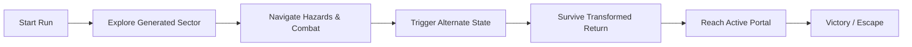

# Alternate

**Alternate** is a 2D pixel-art platformer developed in Godot as a final project.

The game combines responsive platforming with hand-authored level chunks assembled through procedural generation. The player explores a generated dystopian environment, reaches an artifact at the end of the level, triggers an altered version of the world, and must survive the perilous return journey to escape.

---

## Core Features

### Player Movement & Traversal

- Responsive lateral movement, acceleration, and sprinting
- Jump physics tuned with coyote time and jump buffering
- Automatic ledge detection, reach validation, and climbing (facing left or right)
- Dedicated climbable collision layer

### Player Systems & Combat

- Robust health and invulnerability framework
- Dedicated hurtbox, hitbox, and damage calculation pipeline
- Death, respawn, and run restart handling
- Movement, action, and impact sound effects

### Procedural Level Generation

- **Graph-Based Architecture:** High-level logical layout resolved into physical, hand-authored chunk scenes.
- **Dynamic Chunk Types:** Start rooms, goal rooms, growth rooms, corridors, and dead-end terminals.
- **Smart Placement:** Socket-based directional stitching with bounds validation, collision checks, and solver backtracking.
- **Balancing & Variety:** Usage balancing to prevent repetitive chunk runs, weighted chunk selection, and automatic graph regeneration upon placement bottlenecks.
- **Deterministic Seeding:** Readable seed generation with run reproduction and an optional in-game seed HUD toggle.

### Dual-State World ("The Alternate")

- **Phase Shift Mechanic:** Interacting with the goal-room artifact shatters reality, flipping the level into its hostile "Alternate" state.
- **Dynamic Environment Changes:** Shifting environmental hazards and restructured pathing requirements on the return route.
- **Extraction Sequence:** The player must backtrack through the transformed layout to reach the newly activated extraction portal at the original spawn point.

### Enemy AI (Finite State Machine)

- Modular Finite State Machine (FSM) architecture driving enemy logic:
  - **Melee Enemy:** Patrols terrain, acquires player target within line-of-sight/aggro radius, chases aggressively, and executes close-range telegraph attacks.
  - **Ranged Enemy:** Maintains spacing, tracks player's horizontal positioning, and fires moving projectiles with gravity effect and cooldown windows.
- Dynamic enemy spawning via chunk-authored spawn markers.
- Hurtbox/Hitbox interaction with stagger effects on the enemies.

### Environmental Hazards

- Static and animated surface hazards (spikes, floor traps).
- Timing-based traps requiring precise platforming execution.
- World-state-reactive hazards that intensify once the Alternate state is triggered.

### User Interface & Audio

- Complete UI flow: Splash screen, Main Menu, Pause Menu, Settings Panel, and Game Over screen.
- Health display and optional level seed display.
- Full keyboard and controller focus navigation.
- 4-channel audio bus architecture: **Master**, **Music**, **SFX**, and **UI**.
- Persistent user settings for fullscreen and audio volume.

---

## The Gameplay Loop



1. **Infiltration:** Spawn at the start room of a procedurally assembled facility.
2. **Exploration:** Navigate terrain, bypass deadly traps, and defeat patrolling melee and ranged units.
3. **The Trigger:** Reach the core chamber and interact with the Artifact.
4. **The Alternate:** The facility enters a compromised state—new hazards activate, the environment shifts, and escape conditions lock in.
5. **Extraction:** Race back across the modified terrain to the extraction portal to complete the run.

## Project Structure

Alternate is engineered around modular, component-driven design principles in Godot 4:

- `src/characters/`: Player and enemy FSM implementations, states, and hitboxes.
- `src/generation/`: Graph solvers, chunk registries, socket matchers, and placement validators.
- `src/levels/level/chunks`: Hand-authored scene slices categorized by type (corridor, growth, terminal, goal).
- `src/gameplay/`: Reusable game components such as traps, projectiles and weapons
- `src/core/`: Game Management components such as game and setting managers
- `src/ui/`: Menus, transition panels, splashes and in-game HUD layers.
- `src/autoload/`: Global singletons managing world state, audio routing, and seed persistence.

---

## Built With

- **Godot 4.4.1**
- **GDScript**
- Pixel-art assets and animations

## How to Run

1. Install [Godot 4.4.1](https://godotengine.org/).
2. Clone this repository:

   ```bash
   git clone https://github.com/Lex047/alternate
   ```

3. Open Godot.
4. Select Import.
5. Navigate to the cloned project folder and select project.godot.
6. Open the project.
7. Press F5 to run the project.

## Controls

| Action     | Input           |
| ---------- | --------------- |
| Move Left  | A / Left Arrow  |
| Move Right | D / Right Arrow |
| Jump       | Space           |
| Sprint     | Shift           |
| Interact   | E               |
| Attack     | X               |

Controls may change during development.

## In Development

- Additional chunk themes and environmental biomes

- Expanded weapon and item pool via optional treasure rooms

- Environment and biome relevant Game Assets

- Boss encounter guarding the artifact room

- Extended enemy roster with aerial/flying units

- Enemy Pathfinding system

- Speedrun timer and run statistic tracking

## Development Status

This project is actively in development as a final academic project.

## Credits

- Warped City by Ansimuz
  https://ansimuz.itch.io/warped-city
  Licensed under CC0 1.0 (https://creativecommons.org/publicdomain/zero/1.0/)

- BoldPixels Font by Yūki (@YukiPixels)
  https://yukipixels.itch.io/boldpixels
  Licensed under CC BY-SA 4.0 (https://creativecommons.org/licenses/by-sa/4.0/)

- 12 Player Movement SFX by leohpaz
  https://opengameart.org/content/12-player-movement-sfx
  Licensed under CC BY 4.0 (https://creativecommons.org/licenses/by/4.0/)

- SoupTonic's sound SFX Pack 1 - UI menu sounds by SoupTonic
  https://souptonic.itch.io/souptonic-sfx-pack-1-ui-sounds
  Licensed under CC BY 4.0 (https://creativecommons.org/licenses/by/4.0/)

- Future Noir (Looping) by Eric Matyas
  https://opengameart.org/content/future-noir-looping
  Licensed under CC BY 4.0 (https://creativecommons.org/licenses/by/4.0/)

- Cyberpunk Streets In The Dead Of Night by Eric Matyas
  https://opengameart.org/content/cyberpunk-streets-in-the-dead-of-night
  Licensed under CC BY 3.0 (https://creativecommons.org/licenses/by/3.0/)

- Pixel art portal by f1xtach
  https://f1xtach.itch.io/pixel-art-portal

- Pixel art Artifact(Intact + Broken) generated with PixelLab
  https://www.pixellab.ai/

- Pixel Art Animated Traps — Free Game Assets / CraftPix
  https://free-game-assets.itch.io/pixel-art-animated-traps
  https://craftpix.net/file-licenses/

- Enemy Galore I by Admurin
  https://admurin.itch.io/

- dying female by AmeAngelofSin
  https://freesound.org/people/AmeAngelofSin/sounds/345049/
  Licensed under CC BY 4.0 (https://creativecommons.org/licenses/by/4.0/)

## License

This project is created for educational and academic assessment.
All rights to original code and project assembly belong to the author. Third-party assets remain subject to their respective original licenses noted above.
